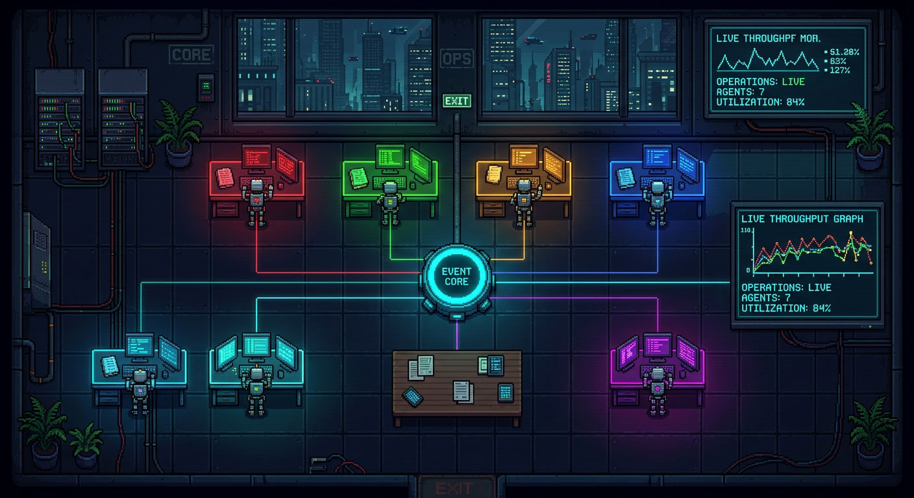

# ESTATE OPS $PUBLISH

**Autonomous real-estate listing operations interface — turn a seller brief into published, verified portal listings.**

Estate Ops $Publish turns a team of seven specialist AI agents into a visible operating system for real-estate publishing. Instead of hiding agent work behind a chat window, it presents the whole workflow as a live operations floor: bots move between workstations, exchange artifacts, report progress, emit telemetry, and stop at an approval boundary before any listing is actually published.



## What the human provides

Press **✎ INPUT** to open the mission panel and give the agents everything they need:

- **Seller brief** — name, phone, photo, description, and the optional YouTube video link.
- **Portal list** — one portal per line (the Excel list of real-estate portals).
- **Portal accounts** — one line per portal as `portal | login | password`, so the agents log into the existing personal cabinets (ЛК). Leave empty to auto-register new profiles.
- **Mandatory data** — `label = value` lines that must appear in **every** listing (price, area, rooms, address, energy class, etc.).

Everything is persisted in `localStorage`, so your input survives a reload.

## What the agents do

The mission lifecycle: `INTAKE → REGISTER → CONTENT → COMPLIANCE → PUBLISH → VERIFY`.

| Agent | Role | Clear task |
| --- | --- | --- |
| **Helm** | Chief of Staff | Receives the mission, parses the seller brief + portal accounts + mandatory data, routes the work graph. |
| **Archive** | Account Registrar | Logs into / registers personal cabinets on each portal using the provided credentials; stores sessions in the vault. |
| **Scout** | Media Specialist | Validates the seller photo and the YouTube video link against portal rules and the mandatory fields. |
| **Forge** | SEO Copywriter | Writes the **SEO selling title** and the listing body from the mandatory data; renders one variant per portal. |
| **Sentinel** | Compliance Auditor | Checks every variant: mandatory fields present, phone masked, photo policy, portal rules. |
| **Relay** | Publisher | Stages the audited pack and pushes the listings to the portals after human approval. |
| **Warden** | Verification Controller | Checks that each listing is actually live on every portal and **compiles the list of published links**. |

### Mission steps

1. **Helm** parses the seller brief, the portal accounts, and the mandatory data and routes them.
2. **Archive** logs into (or registers) the personal cabinets on each portal.
3. **Scout** validates the media; **Forge** generates the **SEO selling title** and 6 portal-ready listing variants that include all mandatory data.
4. **Sentinel** audits compliance and masks the raw seller phone.
5. **Relay** stages the publication and pauses at the **Approval Airlock**.
6. A human approves → listings are published.
7. **Warden** verifies every listing is live and compiles the **published-links list** (portal → public URL), shown in the `VERIFIED PUBLICATIONS` panel.

## What the interface provides

- A continuous pixel-art operations room with seven visible specialist bots.
- Live agent movement through collision-aware office routes.
- Live Agent Comms with routed message cards, animated channels, and moving work packets between specialists.
- Real-time task labels such as `registering personal cabinets`, `writing SEO selling title`, `verifying live listings`.
- Animated wall telemetry, workstation displays, city lights, and a real-time analog clock.
- A mission timeline with progress, ETA, cost, artifacts, and operational stages.
- A realistic event feed containing source discovery, handoffs, warnings, audit results, and system events.
- A cryptographic Listing Ledger with SHA-256 hashes, artifact versions, and parent lineage.
- A persistent visual release rail: `INTAKE → REGISTER → CONTENT → COMPLIANCE → PUBLISH → VERIFY`.
- Audit invalidation when an already-reviewed artifact is revised.
- Human approval controls for the external publication action.
- Responsive full-screen layout for desktop, laptop, tablet, and mobile widths.
- No framework, package installation, build process, or API key required.

## Quick start

```bash
git clone https://github.com/ValenciaAI/AI-PUBLISHING-REAL-ESTATE-.git
cd AI-PUBLISHING-REAL-ESTATE-
```

The application is completely static. Open `index.html` directly, or serve the directory locally:

```bash
npx serve .
# or
python -m http.server 8080
```

## Operating guide

1. Open the interface and confirm all seven agents show as online.
2. Press **✎ INPUT**, enter the seller brief, the portal list, the portal accounts, and the mandatory data, then **Save & use for mission**.
3. Select **Start listing** to begin RE-042.
4. Watch the progress bar, remaining time, spend, agent statuses, and Live Feed.
5. Click any bot to inspect its current task and location.
6. Use the speed selector to run at `1x`, `2x`, `4x`, or `10x`.
7. When Relay reaches the Approval Airlock, select **Inspect**, **Reject**, or **Approve**.
8. After approval, Warden verifies the listings and the `VERIFIED PUBLICATIONS` panel fills with the live portal links.

### Controls

| Control | Action |
| --- | --- |
| `✎ INPUT` | Open the mission panel (seller brief, portals, accounts, mandatory data) |
| `Start listing` | Starts the mission timeline |
| Pause button | Pauses or resumes execution |
| Reset button | Returns agents and mission state to the beginning |
| `1x–10x` | Changes system speed |
| `Space` | Starts, pauses, or resumes |
| `R` | Resets the mission |
| Agent card or bot | Opens the current task and location |

## Interface map

- **Operations Floor** — spatial view of agents, desks, shared equipment, and handoffs.
- **Crew Manifest** — current state and assignment of every bot.
- **Live Feed** — timestamped operational telemetry.
- **Active Mission** — objective, stage, progress, ETA, and risk state.
- **Approval Airlock** — human decision boundary for the publication action.
- **Verified Publications** — the list of published portal links compiled by Warden.

## Architecture

```text
Mission timeline (mission + verify phases)
      ↓
Agent state machine
      ↓
Route and handoff engine
      ↓
Canvas room renderer
      ↓
Live Feed + mission telemetry + approval state + link list
```

The visual layer is intentionally separated from the mission events. A real agent backend can replace the built-in timeline by sending the same state transitions over WebSocket, Server-Sent Events, or an MCP bridge.

### Mock portal transport

`portal-adapter.js` loads before the interface engine and provides a production-shaped local transport without making external requests:

- persistent session IDs stored in `localStorage`;
- realistic connection and command acknowledgement latency;
- heartbeat, uptime, queue-depth, and round-trip telemetry;
- mission start, pause, resume, and reset commands;
- approval request and resolution commands;
- a 40-event local telemetry buffer.

The header deliberately displays `SIM` next to `PORTAL LINK`. Replace `window.portalLink` with an adapter exposing the same methods to connect a real service without changing the canvas renderer or mission controls.

### Listing Ledger and artifact lineage

`listing-ledger.js` is a real event-sourced subsystem running in the browser:

- every ledger event includes the SHA-256 hash of the preceding event;
- artifact payloads are hashed using the Web Crypto API;
- every revision creates a new immutable artifact version;
- parent artifact IDs form a traceable lineage graph;
- an audit is bound to the exact hash it reviewed;
- changing an audited pack automatically marks that audit as stale;
- the release policy verifies lineage and the current audit hash before requesting human approval;
- the ledger, artifacts, and latest policy decision persist in `localStorage`.

Click **LISTING LEDGER** in the upper-left corner of the Operations Floor to inspect artifact passports and full hashes. The release rail stays visible along the bottom of the room and updates as the mission creates, audits, and approves work.

For the instant visual showcase, open:

```text
index.html?autoplay=ledger     # preloaded artifact lineage, approval state
index.html?autoplay=comms      # three inter-agent handoff channels
index.html?autoplay=handoff    # a live two-agent handoff at the table
index.html?autoplay=approval   # stops at the Approval Airlock
index.html?autoplay=verify     # Warden checking live listings
```

### Live Agent Comms

Key mission handoffs publish a visible inter-agent message:

- Helm routes the seller brief to Scout and the portal accounts to Archive;
- Scout transfers the media pack to Forge;
- Forge sends the listing pack to Sentinel;
- Sentinel forwards the signed compliance receipt to Relay;
- Warden broadcasts the verified published links.

The Operations Floor draws the active channel directly between both bots, moves encrypted packets along the route, and keeps the three latest messages in the `LIVE AGENT COMMS` panel.

Suggested production event format:

```json
{
  "missionId": "RE-042",
  "agent": "forge",
  "state": "working",
  "activity": "writing SEO selling title",
  "zone": "writing",
  "progress": 42,
  "timestamp": "2026-08-25T12:00:00Z"
}
```

Consequential operations (publishing to live portals) should always be represented as approval requests and must never be executed directly from a visual status event.

## Project structure

```text
.
├── index.html          Application shell, control panels, mission input, verify panel
├── app.js              Mission engine, 7 agents, routing, canvas renderer, verification
├── portal-adapter.js   Mock transport, commands, heartbeat, persistence
├── listing-ledger.js   Hash chain, artifact versions, lineage, policies
├── styles.css          Base layout and component styles
├── theme-muted.css     Estate Ops theme, setup dialog, published-links panel
├── preview.png         Current interface preview
└── README.md           Product and operating documentation
```

## Customization

- Change agent names, roles, colors, and default positions in the `initial` array inside `app.js`.
- Change the default portal list, seller brief, and mandatory data in `DEFAULT_MISSION` inside `app.js`.
- Add or edit mission events in the `timeline` array and verification events in the `verifyTimeline` array.
- Adjust the six-minute runtime using `state.duration`.
- Add room destinations in the `points` object.
- Add artifact types and lineage relationships through `sealArtifact()` calls in the timelines.
- Replace events with backend messages while keeping the existing `agent()`, `event()`, and `stage()` update model.

## Current status

The interface, movement system, mission state machine, telemetry feed, mock transport, approval flow, and live-link verification run entirely in the browser. External portal login, listing upload, server-side storage, authentication, and real model execution remain integration points for the production backend.

---

*Estate Ops $Publish is an independent interface concept inspired by the Grok Bot $Architecture visual system.*
